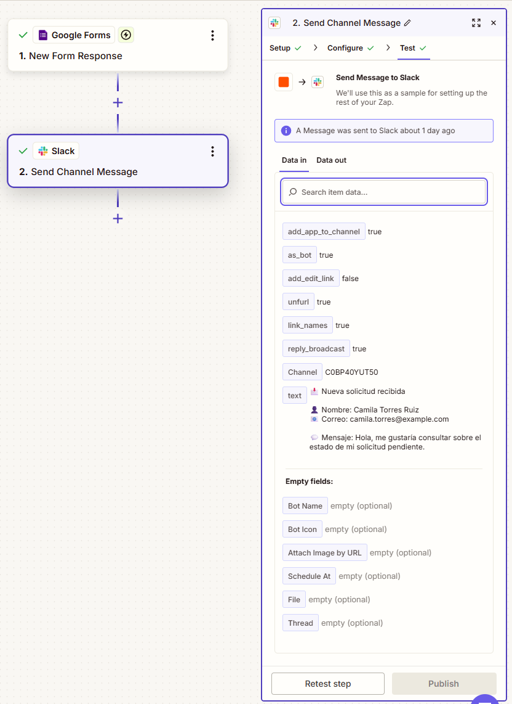

# Google Forms → Slack Request Automation

A no-code workflow that captures incoming requests through **Google Forms**, stores the responses in **Google Sheets**, and automatically sends structured notifications to a **Slack channel** using **Zapier**.

The purpose of this project is to reduce manual monitoring of form submissions and provide immediate visibility of new requests to a team.

## Overview

The workflow connects four services:

* **Google Forms** — collects user requests.
* **Google Sheets** — stores submitted responses.
* **Zapier** — detects new form responses and transfers the submitted data.
* **Slack** — receives structured notifications for each new request.

### Workflow Architecture

```text
                         ┌───────────────────┐
                         │   Google Sheets   │
                         │ Response history  │
                         └────────▲──────────┘
                                  │
                                  │
User ───────▶ Google Forms ───────┤
                                  │
                                  ▼
                               Zapier
                                  │
                                  ▼
                                Slack
                         Team notification
```

## Problem

When requests are collected through an online form, users or team members may need to manually check the form or its associated spreadsheet to discover new submissions.

This introduces unnecessary repetitive work and can delay the processing of new requests.

## Solution

This project automates that process.

Whenever a new Google Forms response is submitted:

1. Google Forms receives the request.
2. The response is stored in the associated Google Sheets spreadsheet.
3. Zapier detects the new submission.
4. Zapier retrieves the submitted values.
5. The values are mapped into a structured Slack message.
6. Slack receives the notification automatically.

This allows a team to monitor new requests directly from Slack while maintaining a complete response history in Google Sheets.

---

## 1. Request Collection — Google Forms

The workflow begins with a simple Google Form.

The example form collects:

* **Name**
* **Email**
* **Message**

These fields represent the information needed to identify the requester and understand their request.


When the form is submitted, Google Forms generates a new response that can be used by other connected services.

---

## 2. Form Response

Each submission generates structured response data.

This is the information that Zapier later retrieves and uses inside the automation.



The response includes values such as:

```text
Name
Email
Message
```

Because these values are retrieved dynamically, the automation can process different users and messages without changing the workflow manually.

---

## 3. Zapier Workflow

Zapier acts as the automation layer between Google Forms and Slack.

The Zap contains two main steps:

```text
Google Forms
New Form Response
       │
       ▼
     Zapier
       │
       ▼
Slack
Send Channel Message
```


### Trigger

**Application:** Google Forms
**Event:** `New Form Response`

The workflow starts whenever Zapier detects a new submission in the selected Google Form.

---

## 4. Data Mapping

After receiving a new response, Zapier makes the form fields available to the Slack action.

The data flow can be represented as:

```text
Google Forms                 Slack Message

Name        ───────────────▶ Name
Email       ───────────────▶ Email
Message     ───────────────▶ Message
```

The Slack message uses a template similar to:

```text
📩 Nueva solicitud recibida

👤 Nombre: {{Name}}
📧 Correo: {{Email}}

💬 Mensaje: {{Message}}
```

Zapier replaces each variable with the values received from the current form submission.


This dynamic mapping is what allows a single Zap to handle multiple independent requests.

---

## 5. Response Storage — Google Sheets

Google Forms also stores the submitted information in an associated Google Sheets spreadsheet.


Google Sheets acts as the historical record of the system.

A typical stored response contains:

```text
Timestamp
Name
Email
Message
```

This means the workflow has two different outputs:

```text
Google Forms
      │
      ├──────────────▶ Google Sheets
      │                 Persistent history
      │
      └──────────────▶ Zapier ─────▶ Slack
                        Immediate notification
```

Slack provides immediate visibility, while Google Sheets preserves the complete record.

---

## 6. Slack Notification

The final step sends the formatted request to the selected Slack channel.


Each notification displays the data corresponding to the individual submission.

For example:

```text
📩 Nueva solicitud recibida

👤 Nombre: Camila Torres Ruiz
📧 Correo: camila.torres@example.com

💬 Mensaje:
Hola, me gustaría consultar sobre el estado de mi solicitud pendiente.
```

Multiple form submissions can therefore generate separate Slack notifications without modifying the automation.

---

## Complete Data Flow

```text
┌──────────┐
│   User   │
└────┬─────┘
     │
     │ Submit request
     ▼
┌──────────────────┐
│   Google Forms   │
└────┬─────────┬───┘
     │         │
     │         └───────────────▶ Google Sheets
     │                            Store response
     │
     │ New Form Response
     ▼
┌──────────────────┐
│      Zapier      │
│                  │
│ Read fields      │
│ Map data         │
│ Build message    │
└────────┬─────────┘
         │
         │ Send Channel Message
         ▼
┌──────────────────┐
│      Slack       │
│                  │
│ Team receives    │
│ notification     │
└──────────────────┘
```

## Technologies Used

| Technology    | Purpose             |
| ------------- | ------------------- |
| Google Forms  | Request collection  |
| Google Sheets | Response storage    |
| Zapier        | Workflow automation |
| Slack         | Team notifications  |

## Concepts Practiced

This project demonstrates:

* Workflow automation
* Trigger/action architecture
* Event-driven workflows
* Dynamic data mapping
* SaaS integrations
* Automated notifications
* Data persistence
* No-code automation
* Workflow testing

## Testing

The workflow was tested using multiple synthetic submissions with different names, email addresses, and messages.

Testing confirmed that:

* Google Forms accepts new requests correctly.
* Responses are stored in Google Sheets.
* Zapier detects new form responses.
* Form fields are retrieved correctly.
* Dynamic values are mapped into the Slack message.
* Notifications are successfully delivered to Slack.
* Multiple submissions can be processed independently.

All information shown in the screenshots was created specifically for testing purposes.

## Current Limitations

Version 1.0 intentionally keeps the workflow simple.

The current implementation does not include:

* Request categorization.
* Priority detection.
* Conditional routing.
* Automatic email replies.
* AI-based classification.
* CRM integration.
* Advanced failure handling.
* Retry logic.

## Possible Improvements

Future versions could extend the workflow with:

* Automatic request categorization.
* Priority detection based on message content.
* AI-assisted classification.
* Email confirmation to the requester.
* Conditional routing to different Slack channels.
* CRM or database integration.
* Automated follow-up workflows.
* Error notifications and retry mechanisms.

## Project Status

**Completed — Version 1.0**

The core workflow is functional and was successfully tested with multiple sample submissions.
