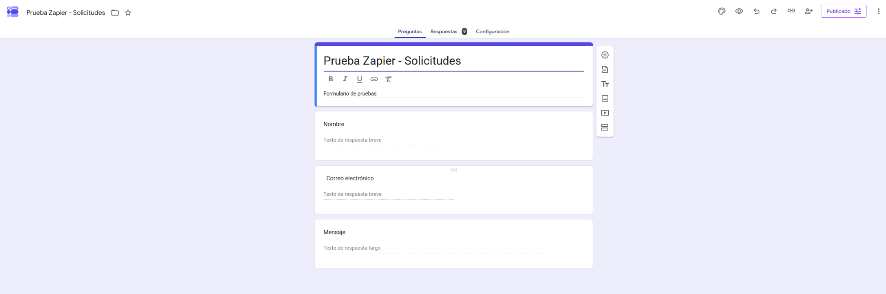
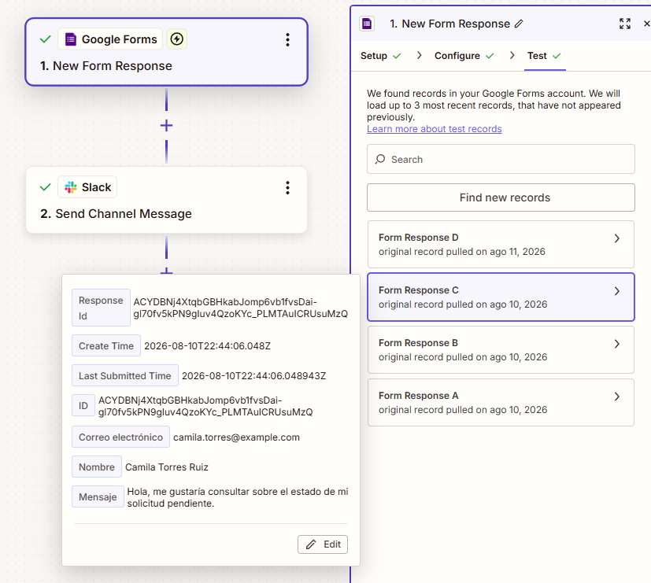
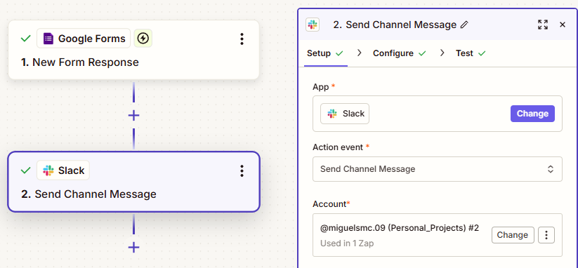
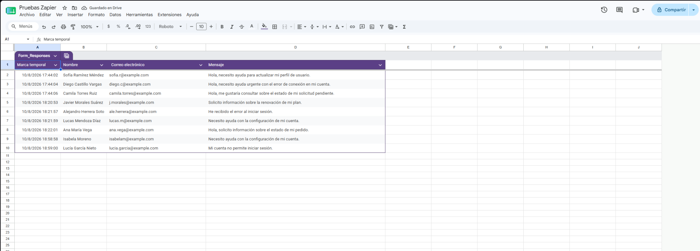
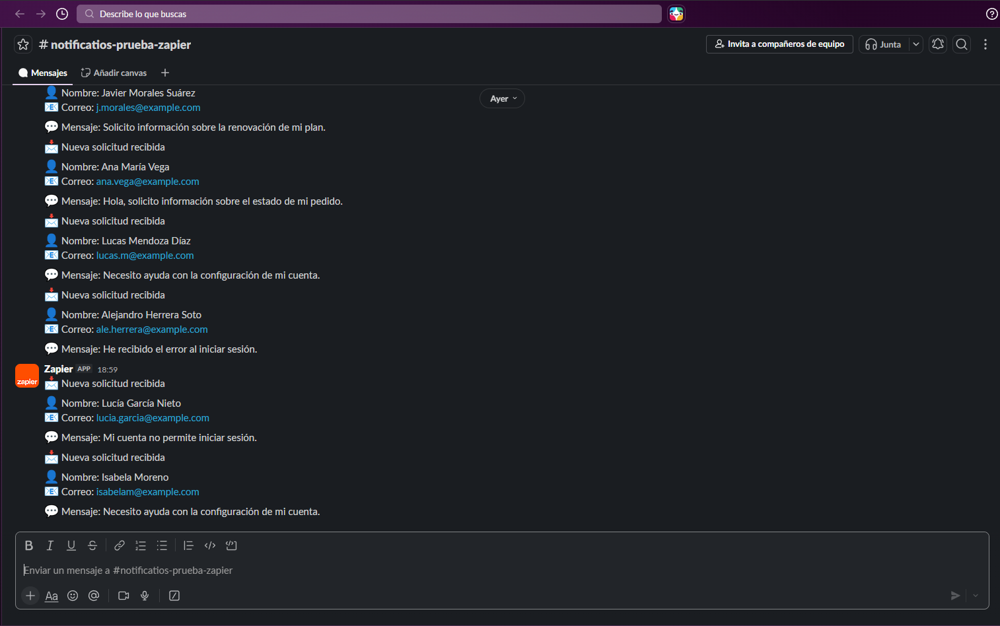

# Google Forms → Slack Request Automation

A no-code workflow that captures incoming requests through **Google Forms**, stores the responses in **Google Sheets**, and automatically sends structured notifications to a **Slack channel** using **Zapier**.

The goal of this project is to eliminate the need to manually monitor form submissions and allow a team to receive new requests in an organized way.

## Overview

The workflow connects four services:

* **Google Forms** — collects user requests.
* **Google Sheets** — stores submitted responses.
* **Zapier** — detects new form responses and processes the workflow.
* **Slack** — receives an automatic notification containing the submitted information.

### Workflow

```text
                         ┌──→ Google Sheets
                         │    Response storage
                         │
User → Google Forms ─────┤
                         │
                         └──→ Zapier → Slack
                              Automatic notification
```

## Problem

When requests are collected through an online form, team members may need to manually check the form or its associated spreadsheet to discover new submissions.

This creates unnecessary manual work and can delay the response to new requests.

## Solution

This workflow automates the notification process.

Whenever a new response is submitted through Google Forms:

1. The response is recorded in Google Sheets.
2. Zapier detects the new form submission.
3. The submitted fields are retrieved dynamically.
4. Zapier creates a structured Slack message.
5. The message is automatically sent to the selected Slack channel.

The team can therefore see new requests directly in Slack without continuously checking Google Forms or Google Sheets.

## Form Structure

The example form collects three fields:

* **Name**
* **Email**
* **Message**



## Automation

The Zap consists of two main steps:

### 1. Trigger — Google Forms

**Event:** `New Form Response`

Zapier monitors the selected Google Form and starts the workflow when a new response is received.

### 2. Action — Slack

**Event:** `Send Channel Message`

Zapier sends a message to a designated Slack channel using data obtained from the form response.



## Dynamic Field Mapping

The Slack notification is dynamically generated using values from each Google Forms submission.

The following fields are mapped:

```text
📩 New request received

👤 Name:    {{Name}}
📧 Email:   {{Email}}
💬 Message: {{Message}}
```

This allows the same automation to process different users and requests without manually modifying the workflow.



## Data Storage

Google Forms stores submitted responses in its associated Google Sheets spreadsheet.

This provides a historical record of all requests while Slack is used for immediate team notifications.



## Result

After a user submits the form, the request automatically appears in the configured Slack channel.

Multiple submissions can be processed using the same workflow, with each notification containing the corresponding name, email, and message.



## Technologies Used

| Technology    | Purpose             |
| ------------- | ------------------- |
| Google Forms  | Request collection  |
| Google Sheets | Response storage    |
| Zapier        | Workflow automation |
| Slack         | Team notifications  |

## Concepts Practiced

This project demonstrates:

* Workflow automation
* Trigger/action architecture
* Event-driven workflows
* Dynamic data mapping
* SaaS integrations
* Automated notifications
* No-code automation
* Workflow testing

## Testing

The workflow was tested using multiple sample submissions with different names, email addresses, and messages.

Testing confirmed that:

* New Google Forms responses trigger the automation.
* Form fields are retrieved correctly.
* Dynamic values are mapped to the Slack message.
* Messages are successfully delivered to the configured Slack channel.
* Multiple submissions can be processed independently.

All information shown in the project screenshots uses sample data created for testing purposes.

## Possible Improvements

Future versions of the workflow could include:

* Automatic request categorization.
* Priority detection.
* Email confirmations for users.
* AI-based message classification.
* CRM or database integration.
* Conditional routing based on request type.
* Error handling and failure notifications.

## Project Status

**Completed — Version 1.0**

The core workflow is functional and has been successfully tested with multiple sample submissions.
